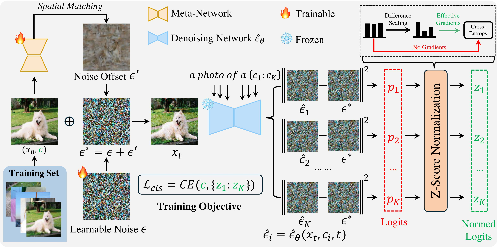

# NoOp (NeurIPS 2025)

**NoOp is a simple yet effective noise optimization method for the Diffusion Classifier.** 

> [**Noise Matters: Optimizing Matching Noise for Diffusion Classifiers**](https://arxiv.org/pdf/2508.11330)
> 
> Yanghao Wang, Long Chen  

# Prepare the Execution Environment
conda env create -f environment.yml

# Prepare the Few-shot Training Set
python build_fewshot_dataset.py

# Run main.py for NoOp
torchrun --nnodes=1 --nproc_per_node=8 --node_rank=0 --master_addr=xx.xxx.xxx --master_port=29500 main.py
